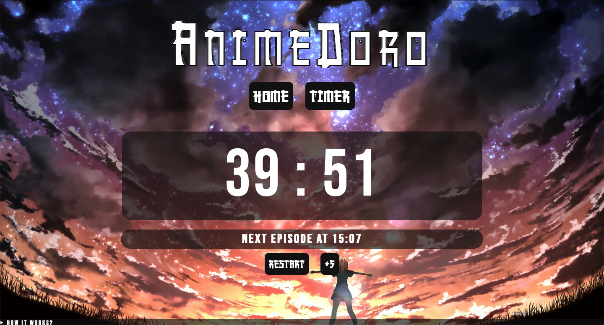
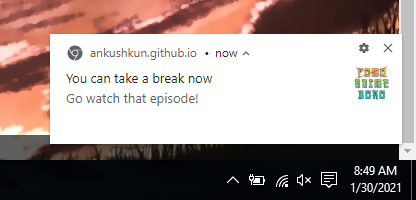

# Animedoro Timer ⏱

    

## What is AnimeDoro?

It's like **pomodoro**, but with **Anime**
Instead of regular 25+5 pomodoro technique,
Animedoro uses 40+20 timers
you work at your own pace for 40 to 60 minutes
then watch an episode of anime for 20 minutes
and continue the cycle.\
***For more info watch this video by [Josh Chen](https://www.youtube.com/watch?v=bUjGZJIgse0)***\
productivity : 📈

## Use the **[animedoro timer](https://ankushkun.github.io/projects/animedoro-timer/Animedoro/index.html)** 😄

## Screenshots

## TODO

- [ ] A settings section to set custom timers
- [ ] A browser extension?
